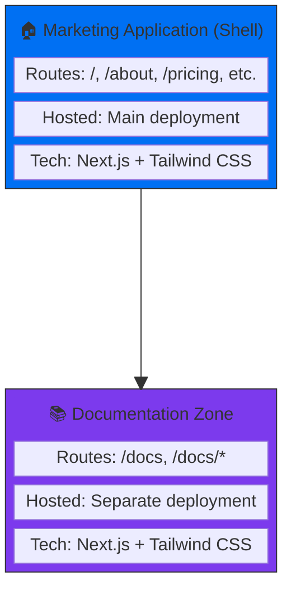

<picture>
  <source srcset="https://assets.vercel.com/image/upload/v1689795055/docs-assets/static/docs/microfrontends/mfe-banner-dark.png" media="(prefers-color-scheme: dark)">
  <source srcset="https://assets.vercel.com/image/upload/v1689795055/docs-assets/static/docs/microfrontends/mfe-banner-light.png" media="(prefers-color-scheme: light)">
  
</picture>

# Vercel Microfrontends - Next.js Multi-Zones example

**An official Vercel example demonstrating production-ready multi-zone microfrontend architecture**

This comprehensive example showcases how to build and deploy a multi-zone microfrontend application using [Vercel Microfrontends](https://vercel.com/docs/microfrontends) with [Next.js App Router](https://nextjs.org/docs/app/building-your-application/routing). Learn how to architect independent, deployable frontend applications that work together seamlessly while maintaining team autonomy and deployment independence.

Demo URL: https://vercel-microfrontends-multi-zones.vercel.app/

## 🚀 Deploy to Vercel

Deploy each microfrontend independently to experience the full power of distributed development:

| Application       | Description                                                        | Deploy                                                                                                                                                                                                                                                                                                                           |
| ----------------- | ------------------------------------------------------------------ | -------------------------------------------------------------------------------------------------------------------------------------------------------------------------------------------------------------------------------------------------------------------------------------------------------------------------------- |
| **Marketing**     | Main application handling homepage, pricing, and marketing content | [](https://vercel.com/new/clone?repository-url=https%3A%2F%2Fgithub.com%2Fvercel-labs%2Fmicrofrontends-nextjs-app-multi-zone&project-name=microfrontends-nextjs-app-multi-zone-marketing&repository-name=microfrontends-nextjs-app-multi-zone&root-directory=apps%2Fmarketing) |
| **Documentation** | Dedicated docs microfrontend handling all `/docs` routes           | [](https://vercel.com/new/clone?repository-url=https%3A%2F%2Fgithub.com%2Fvercel-labs%2Fmicrofrontends-nextjs-app-multi-zone&project-name=microfrontends-nextjs-app-multi-zone-docs&repository-name=microfrontends-nextjs-app-multi-zone&root-directory=apps%2Fdocs)       |

---

## What You'll Learn

This example demonstrates real-world microfrontend patterns and best practices:

- **🏗️ Multi-zone Architecture**: Build independent applications that feel like a single experience
- **🔄 Dynamic Routing**: Seamlessly route between different microfrontends based on URL patterns
- **⚡ Development Experience**: Hot reload across multiple applications simultaneously
- **📦 Shared Dependencies**: Efficiently manage common packages and components
- **🚀 Independent Deployments**: Deploy each microfrontend without affecting others
- **🎯 Team Autonomy**: Enable teams to work independently while maintaining consistency

---

## Understanding Microfrontends

Microfrontends extend the microservices concept to frontend development, allowing you to:

- **Scale Development Teams**: Multiple teams can work on different parts of the application independently
- **Technology Flexibility**: Each microfrontend can use different technologies or versions
- **Deployment Independence**: Deploy features without coordinating with other teams
- **Fault Isolation**: Issues in one microfrontend don't affect others
- **Incremental Upgrades**: Modernize parts of your application gradually

---

## Architecture Overview

This example implements a **multi-zone architecture** where:



### Key Components

1. **Marketing Application** (`apps/marketing/`)

   - Primary application handling the main website
   - Contains homepage, pricing, and general marketing content
   - Acts as the shell application orchestrating other microfrontends

2. **Documentation Application** (`apps/docs/`)

   - Dedicated documentation microfrontend
   - Handles all `/docs` routes
   - Can be developed and deployed independently

3. **Shared Packages** (`packages/`)
   - Common TypeScript configurations
   - Shared ESLint rules and formatting standards
   - Ensures consistency across all applications

---

## Getting Started

### Prerequisites

Ensure you have the following installed:

- **Node.js 20.x** or later
- **pnpm 9.4.0** (recommended package manager)
- **Git** for version control

### Local Development Setup

1. **Clone the repository**:

   ```bash
   git clone https://github.com/vercel-labs/microfrontends-nextjs-app-multi-zone.git
   cd microfrontends-nextjs-app-multi-zone
   ```

2. **Install dependencies**:

   ```bash
   pnpm install
   ```

3. **Start the development environment**:
   ```bash
   pnpm dev
   ```

This command starts both applications simultaneously:

- **Marketing app**: http://localhost:3000
- **Documentation app**: http://localhost:3001 (automatically proxied through marketing app)

4. **Access the application**:
   Open http://localhost:3024 in your browser and navigate between different sections to see the microfrontend routing in action.

---

## Project Structure Deep Dive

```
microfrontends-nextjs-app-multi-zone/
├── apps/
│   ├── marketing/              # Main application (shell)
│   │   ├── app/               # Next.js App Router pages
│   │   ├── components/        # UI components
│   │   ├── lib/              # Utilities and helpers
│   │   ├── microfrontends.json # Routing configuration
│   │   └── next.config.ts    # Next.js configuration with MFE setup
│   │
│   └── docs/                  # Documentation microfrontend
│       ├── app/              # Documentation pages
│       ├── components/       # Doc-specific components
│       ├── lib/             # Documentation utilities
│       └── next.config.ts   # Standalone Next.js configuration
│
├── packages/
│   ├── eslint-config-custom/  # Shared linting configuration
│   └── ts-config/            # Shared TypeScript configuration
│
├── package.json              # Root package.json with workspaces
├── pnpm-workspace.yaml       # PNPM workspace configuration
└── turbo.json               # Turborepo build pipeline
```

### Configuration Files Explained

#### `microfrontends.json`

This file defines how microfrontends are discovered and routed:

- **Applications mapping**: Defines each microfrontend and its ports
- **Routing rules**: Specifies which URLs should be handled by which microfrontend
- **Development settings**: Local ports and fallback URLs for development

#### `next.config.ts`

Each application has its own Next.js configuration enhanced with:

- `withMicrofrontends()`: Enables microfrontend capabilities
- `withVercelToolbar()`: Adds development debugging tools
- Standard Next.js optimizations and settings

---

## How Microfrontend Routing Works

The magic happens through the `@vercel/microfrontends` package:

### 1. **Route Discovery**

The marketing application (shell) reads the `microfrontends.json` configuration to understand which routes should be handled by which microfrontend.

### 2. **Dynamic Proxying**

When a user navigates to `/docs`, Vercel Microfrontends:

- Recognizes this route belongs to the documentation microfrontend
- Proxies the request to the documentation application
- Returns the response seamlessly to the user

All routing between microfrontends is handled dynamically by Vercel Microfrontends, allowing for a smooth user experience without page reloads.

### 3. **Development Magic**

During development, both applications run simultaneously, and the routing happens transparently, providing a seamless development experience.

### 4. **Production Deployment**

In production, each microfrontend is deployed independently to Vercel, and the routing configuration ensures requests are directed to the correct deployment.


Learn more in the [routing documentation](https://vercel.com/docs/microfrontends/path-routing).

---

## Development Workflow

### Working with Individual Microfrontends

You can develop microfrontends in isolation using the [microfrontends local development proxy](https://vercel.com/docs/microfrontends/local-development):

```bash
# Work on the marketing application only
cd apps/marketing
pnpm dev

# Work on the documentation application only
cd apps/docs
pnpm dev
```

### Building and Testing

```bash
# Build all applications
pnpm build

# Run linting across all apps
pnpm lint

# Type check all applications
pnpm typecheck

# Run all quality checks
pnpm checks
```

### Adding New Microfrontends

1. **Create a new application** in the `apps/` directory
2. **Update `microfrontends.json`** to include routing rules
3. **Add the new app** to the workspace configuration
4. **Configure deployment** settings for the new microfrontend

Learn more in the [Managing Microfrontends](https://vercel.com/docs/microfrontends/managing-microfrontends) documentation.

---

## Deployment Strategy

### Independent Deployment Benefits

Each microfrontend can be deployed independently, enabling:

- **Faster deployments**: Only the changed microfrontend needs redeployment
- **Reduced risk**: Deployments are isolated and can't break other parts
- **Team autonomy**: Teams can deploy on their own schedule
- **Rollback flexibility**: Roll back individual microfrontends without affecting others

### Vercel Configuration

Each application includes optimized Vercel configuration:

- **Framework detection**: Automatic Next.js optimization
- **Build settings**: Turborepo-aware build commands
- **Environment variables**: Proper environment isolation
- **Edge functions**: Optimal performance at the edge

---

## Best Practices Implemented

### 🎯 **Consistent Development Experience**

- Shared TypeScript configuration ensures type safety across all apps
- Common ESLint rules maintain code quality standards
- Unified prettier configuration for consistent formatting

### 🔧 **Build Optimization**

- Turborepo orchestrates builds efficiently with caching
- Shared dependencies reduce bundle duplication
- Independent builds enable faster CI/CD pipelines

### 🎨 **UI Consistency**

- Shared component library (Tailwind CSS + shadcn/ui)
- Consistent design tokens across applications
- Reusable UI components prevent design drift

### 🚀 **Performance Optimization**

- Code splitting at the microfrontend level
- Independent bundle optimization
- Edge-optimized routing and caching

---

## Advanced Features

### Vercel Toolbar Integration

Development builds include the Vercel Toolbar for enhanced debugging:

- Visual indicators of microfrontend boundaries
- Performance metrics and analytics
- Real-time feature flag management

### Analytics and Monitoring

Built-in integration with:

- **Vercel Analytics**: Track user behavior across microfrontends
- **Speed Insights**: Monitor performance metrics
- **Error tracking**: Isolated error reporting per microfrontend

---

## Troubleshooting

### Common Issues and Solutions

**Port conflicts during development:**

```bash
# Kill processes using the required ports
npx kill-port 3000 3001
pnpm dev
```

**Routing not working in development:**

- Verify `microfrontends.json` configuration
- Ensure all applications are running
- Check console for proxy errors

**Build failures:**

- Run `pnpm typecheck` to identify TypeScript issues
- Verify all dependencies are installed correctly
- Check for circular dependencies between applications

---

## Configuration and Components

### Next.js Configuration in This Project

Both applications use `withMicrofrontends` to enable cross-zone routing:

```typescript
// apps/marketing/next.config.ts & apps/docs/next.config.ts
import { withMicrofrontends } from '@vercel/microfrontends/next/config';
import { withVercelToolbar } from '@vercel/toolbar/plugins/next';

export default withVercelToolbar()(
  withMicrofrontends(nextConfig, { debug: true }),
);
```

### Routing Configuration

The marketing app defines how to route to the docs microfrontend:

```jsonc
// apps/marketing/microfrontends.json
{
  "applications": {
    "microfrontends-nextjs-app-multi-zone-marketing": {
      "development": {
        "local": 3000,
        "fallback": "microfrontends-nextjs-app-multi-zone-marketing.vercel.app",
      },
    },
    "microfrontends-nextjs-app-multi-zone-docs": {
      "development": { "local": 3001 },
      "routing": [{ "group": "docs", "paths": ["/docs", "/docs/:path*"] }],
    },
  },
}
```

### Optimizing Cross-Microfrontend Navigation

The `@vercel/microfrontends` package can be used to prefetch and prerender links to other microfrontends.

First, embed the `PrefetchCrossZoneLinksProvider` element in the root `layout.tsx` of your application.

Then, use the enhanced `Link` component for seamless optimized navigation between zones:

```tsx
// In marketing app - navigating to docs
import { Link } from '@vercel/microfrontends/next/client';

<Link href="/docs">View Documentation</Link>
<Link href="/docs/getting-started">Getting Started Guide</Link>
```

This setup enables the marketing app to seamlessly route `/docs` requests to the documentation microfrontend while maintaining a unified user experience.

Learn more in the [Optimizing Hard Navigations](https://vercel.com/docs/microfrontends/managing-microfrontends#optimizing-navigations-between-microfrontends) documentation.